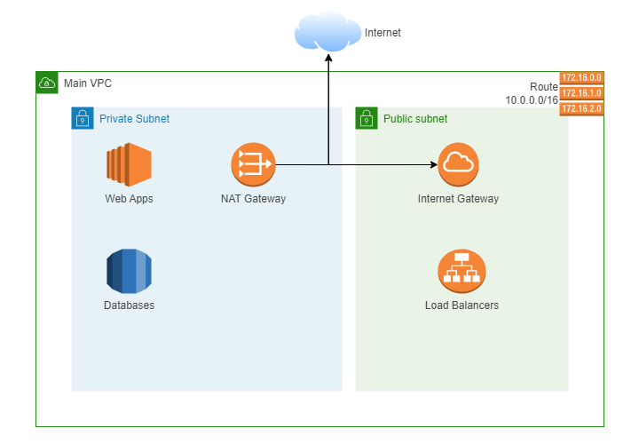

# Main VPC Stack
A simple Cloudformation Stack that creates the main VPC in AWS.

## Diagram (WIP)

## Objectives
- Make the common resources IaC
- Learn more about networking

## Roadmap
- [ ] Finish the initial AWS Stack
- [ ] Transform to Terraform
